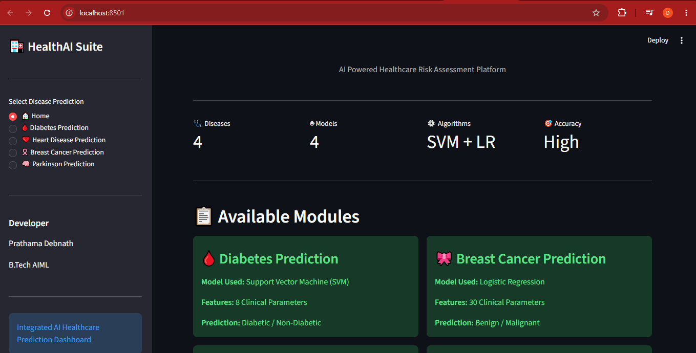
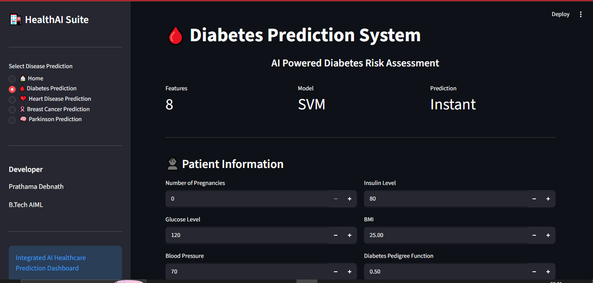
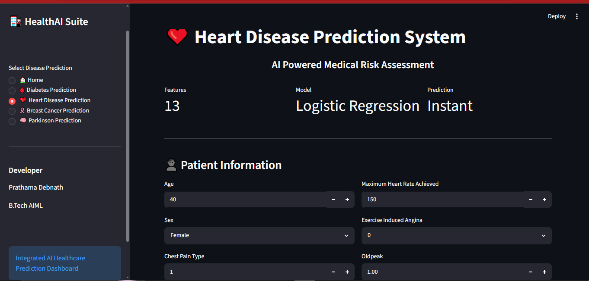
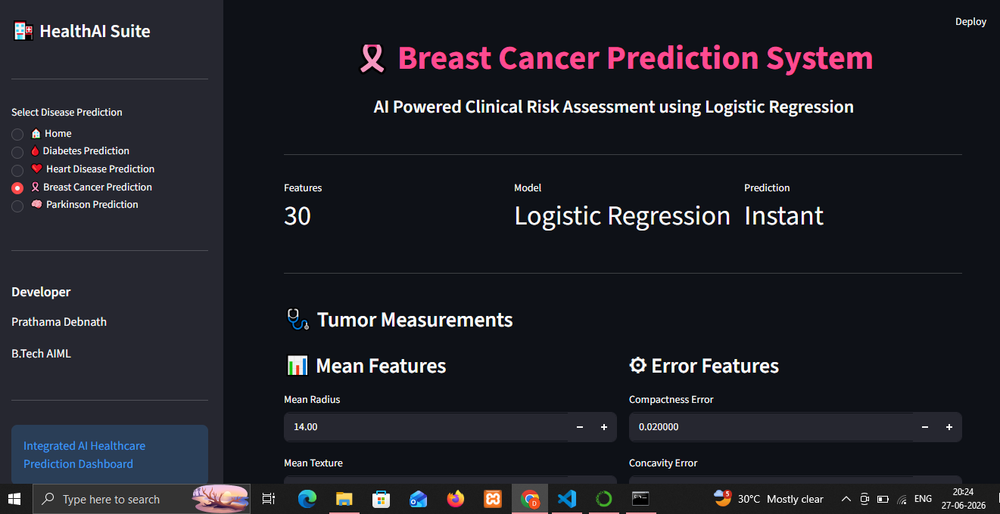

# 🏥 HealthAI Suite - Multiple Disease Prediction System

An AI-powered healthcare application developed using **Streamlit** and **Machine Learning** that predicts multiple diseases from patient clinical data.

---

# 🚀 Features

- Diabetes Prediction
- Heart Disease Prediction
- Breast Cancer Prediction
- Parkinson Disease Prediction

---

# 🛠 Technologies Used

- Python
- Streamlit
- Scikit-Learn
- NumPy
- Pickle

---

# Machine Learning Models

| Disease | Algorithm |
|----------|-----------|
| Diabetes | Support Vector Machine (SVM) |
| Heart Disease | Logistic Regression |
| Breast Cancer | Logistic Regression |
| Parkinson Disease | Support Vector Machine (SVM) |

---

# 📷 Application Screenshots

## 🏠 Home Dashboard



---

## 🩸 Diabetes Prediction



---

## ❤️ Heart Disease Prediction



---

## 🎀 Breast Cancer Prediction



---

## 🧠 Parkinson Prediction


---

# ▶️ Installation

Clone the repository

```bash
git clone https://github.com/YourUsername/codealpha_tasks.git
```

Move inside the project

```bash
cd "Multiple Disease Prediction"
```

Install dependencies

```bash
pip install -r requirements.txt
```

Run the application

```bash
streamlit run Multiple_Disease_Prediction_Web_App.py
```

---

# 👩‍💻 Developer

**Prathama Debnath**

B.Tech AIML

SRM Institute of Science and Technology

---

# ⭐ Internship Project

Developed as part of the **CodeAlpha Machine Learning Internship**.
